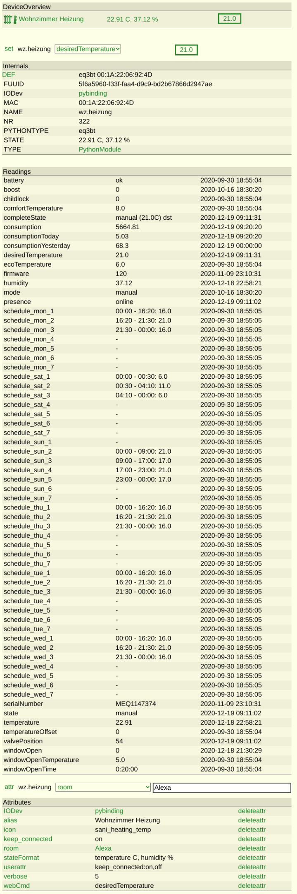

# EQ3 Bluetooth Thermostat
This module is used to control EQ3 Bluetooth thermostats.

Attention: Firmware version 120 is recommended, do not install the newest calor BT firmware! Newer firmwares won't work with this module.

## Installation
Add the following settings to `/etc/dbus-1/system.d/bluetooth.conf`
```
  <policy user="fhem">
    <allow own="org.bluez"/>
    <allow send_destination="org.bluez"/>
    <allow send_interface="org.bluez.GattCharacteristic1"/>
    <allow send_interface="org.bluez.GattDescriptor1"/>
    <allow send_interface="org.freedesktop.DBus.ObjectManager"/>
    <allow send_interface="org.freedesktop.DBus.Properties"/>
  </policy>
```
Set the user to the one which runs fhempy. On FHEM installations it's fhem, on remote peers it's normally pi.
Restart dbus afterwards: `sudo systemctl restart dbus`

## Usage
```
define thermostat1 PythonModule eq3bt <MAC>
```

## Commands
 - boost on|off
 - childlock on|off
 - comfort
 - desiredTemperature
 - eco
 - mode manual|auto
 - off
 - on
 - resetConsumption all|consumption|consumptionToday|consumptionYesterday
 - updateStatus

## Readings
 - consumption: 1 unit of consumption means 100% valve open for 1 minute. E.g. consumption 10 means 10 minutes valve 100% open or 20 minutes valve 50% open.

## Attributes
 - keep_connected
    - on (default): Connections stays active and commands are more reliable.
    - off: connection is dropped after every command. Command execution takes longer.

## Screenshot
