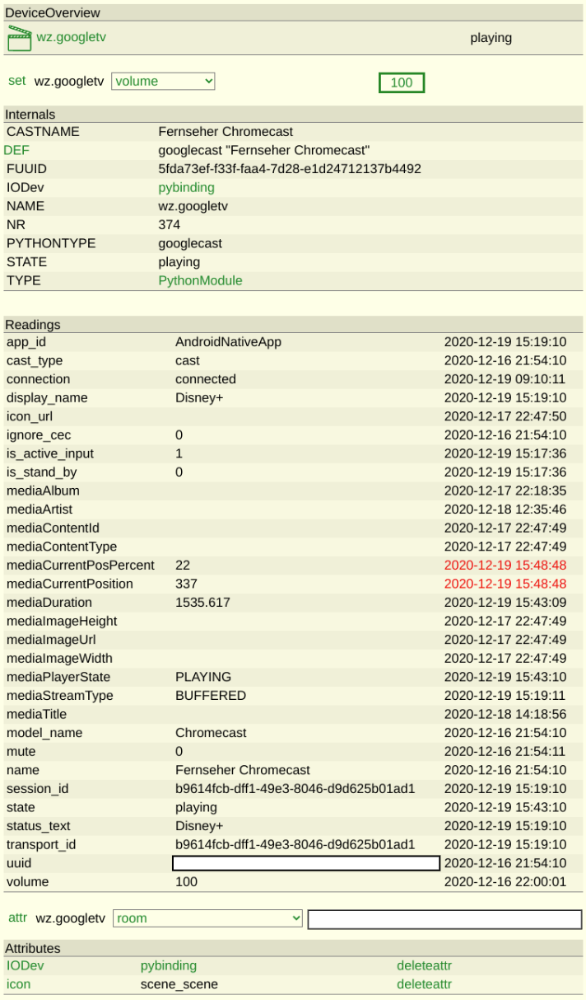

# Google Cast module for all cast enabled devices
This module can be used to control cast enabled devices like Google Home, Nest Hub Max, Nest Home, Chromecast, .... Every device which supports the cast protocol should be controlable.

## Usage
```
define cast PythonModule googlecast <NAME>
```

 - NAME: Name of the cast device (e.g. "Living Room"). You need to use quotes if the name contains spaces.

## Commands
 - addToQueue
 - displayWebsite: Uses dashcast to display a website on Chromecast, NestHub or other cast devices
 - next
 - pause
 - play: E.g. set dev play https://url.to.youtube or set dev play to just resume playback. URLs other than YouTube will be played in the default media renderer. It might take some seconds for the video stream to show up.
 - playFavorite
 - prev
 - quitApp
 - rewind
 - seek
 - skip
 - speak: E.g. set dev speak "Good morning"
 - startApp
 - stop
 - subtitles
 - volDown
 - volUp
 - volume

## Screenshot
